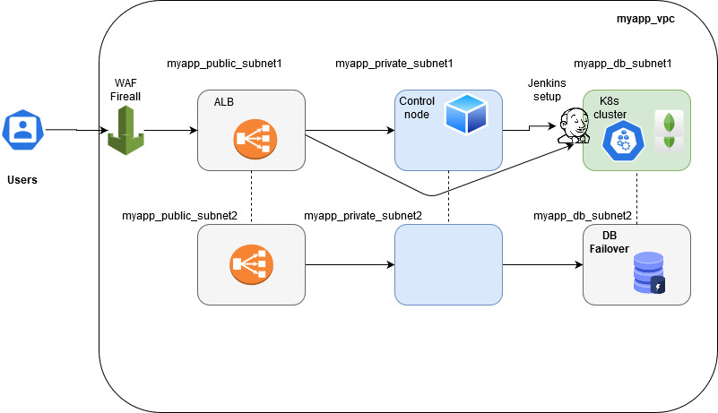

#### mongoDBK8s
MongoDB K8s Deployment

Follwing are the steps I am dividing the whole application into modules,

1) Architecture from security presepective
2) clusterd database
3) K8s deployment
4) DR strategy -- DR as a Service(DaaS)
5) CI/CD pipeline

### Architecture Diagram

